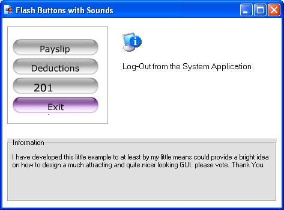



## Flash Button \- VB 6 \(with Sounds\)

### Description

This is an updated version of my Previous submission about Flash buttons in vb6 forms. this time i have provided a much more better capability, buttons can now play a wav file on the Mouse-Over triggered event. be sure you have our speaker on to hear the accompanying wav.

Please Vote..thank you.
 
### More Info
 
Please add this script on the Design of your buttons in Flash. (Just Right Click, then choose Action - Use the Expert Mode to Add this script.)

on (release)

{

fscommand("ButtonClick", "cmdFire");

}

on (rollOver)

{

fscommand("RollOver", "cmdFire");

}

             |
---                |---
**Submitted On**   |2000-09-01 12:23:18
**By**             |[WCM](https://github.com/Planet-Source-Code/PSCIndex/blob/master/ByAuthor/wcm.md)
**Level**          |Beginner
**User Rating**    |4.5 (18 globes from 4 users)
**Compatibility**  |VB 6\.0
**Category**       |[Custom Controls/ Forms/  Menus](https://github.com/Planet-Source-Code/PSCIndex/blob/master/ByCategory/custom-controls-forms-menus__1-4.md)
**World**          |[Visual Basic](https://github.com/Planet-Source-Code/PSCIndex/blob/master/ByWorld/visual-basic.md)
**Archive File**   |[Flash\_Butt1856142212005\.zip](https://github.com/Planet-Source-Code/wcm-flash-button-vb-6-with-sounds__1-59054/archive/master.zip)

